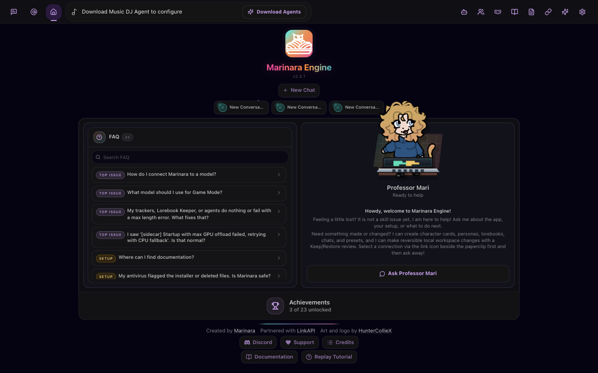

### [Marinara Engine](https://github.com/Pasta-Devs/Marinara-Engine)

> Handle: `marinara`<br/>
> URL: [http://localhost:35030](http://localhost:35030)

Marinara Engine is a local-first AI chat, roleplay, and game-master frontend. It ships three interaction modes: Conversation (Discord-style direct messages), Roleplay (character sprites and backgrounds), and Game mode (an AI Game Master with party mechanics and quests). Model connections (OpenAI, Anthropic, Gemini, or any OpenAI-compatible endpoint) are configured entirely in the web UI and stored in its data volume — there is no env var that seeds one.



#### Starting

```bash
harbor pull marinara
harbor up marinara --open
```

On first launch, complete onboarding in the browser, then open **Connections** to add a model provider. See [Using a Harbor Backend](#using-a-harbor-backend) below to point Marinara at a local Harbor service instead of a paid API.

#### Configuration

##### Environment Variables

Following options can be set via [`harbor config`](./3.-Harbor-CLI-Reference.md#harbor-config):

```bash
# Web UI port on the host
HARBOR_MARINARA_HOST_PORT          35030

# Docker image and tag
HARBOR_MARINARA_IMAGE              ghcr.io/pasta-devs/marinara-engine
HARBOR_MARINARA_VERSION            latest

# Persistent data root
HARBOR_MARINARA_WORKSPACE          ./services/marinara

# Server log level: debug, info, warn, error
HARBOR_MARINARA_LOG_LEVEL          warn

# Allows Marinara to reach AI provider URLs on private/LAN/Docker addresses,
# such as other Harbor services. See "Using a Harbor Backend" below.
HARBOR_MARINARA_LOCAL_URLS         false

# Required secret for privileged Marinara APIs (admin cleanup, backups, bulk
# import, sidecar install/download, etc.)
HARBOR_MARINARA_ADMIN_SECRET

# AES key Marinara uses to encrypt stored provider API keys at rest.
# Rotating this makes previously stored keys unreadable.
HARBOR_MARINARA_ENCRYPTION_KEY

# HTTP Basic Auth, required before exposing Marinara beyond loopback/Docker
HARBOR_MARINARA_BASIC_AUTH_USER
HARBOR_MARINARA_BASIC_AUTH_PASS

# Comma-separated reverse-proxy/public hostnames accepted by the Host check
HARBOR_MARINARA_TRUSTED_HOSTS

# Comma-separated browser origins trusted for CSRF-protected requests
HARBOR_MARINARA_CSRF_TRUSTED_ORIGINS

# Comma-separated IPs or CIDR ranges always allowed in, bypassing auth.
# Loopback is always allowed regardless of this list.
HARBOR_MARINARA_IP_ALLOWLIST

# Whether the IP_ALLOWLIST above is enforced. Defaults to true upstream, so
# setting HARBOR_MARINARA_IP_ALLOWLIST alone is enough to start allowing those
# addresses in.
HARBOR_MARINARA_IP_ALLOWLIST_ENABLED true
```

Use the [`harbor marinara`](./3.-Harbor-CLI-Reference.md#harbor-marinara) CLI to manage most of these without touching `harbor config` directly:

```bash
harbor marinara version [tag]        # Get/set the image tag
harbor marinara secret [secret]      # Get/set ADMIN_SECRET
harbor marinara key [key]            # Get/set ENCRYPTION_KEY
harbor marinara key generate         # Generate and set a new ENCRYPTION_KEY
harbor marinara auth <user> <pass>   # Set BASIC_AUTH_USER/BASIC_AUTH_PASS
harbor marinara trusted-hosts [hosts]    # Get/set TRUSTED_HOSTS (comma-separated)
harbor marinara csrf-origins [origins]   # Get/set CSRF_TRUSTED_ORIGINS (comma-separated)
harbor marinara ip-allowlist [ips]       # Get/set IP_ALLOWLIST (comma-separated IPs/CIDRs)
harbor marinara log [level]          # Get/set LOG_LEVEL
harbor marinara local [on|off]       # Get/set the local-URLs gate (see below)
harbor marinara workspace            # Open the Marinara workspace directory
```

`trusted-hosts`, `csrf-origins`, and `ip-allowlist` each take the **whole** comma-separated
value as one argument — quote it in your shell, e.g.
`harbor marinara ip-allowlist "192.168.1.0/24,10.0.0.5"`. Re-running the command replaces the
previous value; it doesn't append to it.

##### Volumes

Marinara persists data under `services/marinara/data`, mounted to `/app/data` — the SQLite database, uploads, generated assets, and stored (encrypted) provider API keys. The container starts as root, `chown`s this directory to the host user (via `HARBOR_USER_ID`/`HARBOR_GROUP_ID`), then drops privileges, so the directory stays deletable without `sudo`.

#### Using a Harbor Backend

Marinara has no env var to auto-configure a model provider — every connection is created by hand in **Connections → New**. To point it at a Harbor-hosted backend instead of a paid API:

1. Open the local-URL gate, since container-to-container addresses are private IPs that Marinara blocks by default:
   ```bash
   harbor marinara local on
   harbor down marinara && harbor up marinara
   ```
2. In the UI, go to **Connections → New**, choose **Custom (OAI-Compatible)**, leave **API Key** blank, and set **Base URL** to:

   | Backend | Base URL |
   |---|---|
   | `dmr` | `http://dmr:8080/v1` |
   | `llamacpp` | `http://llamacpp:8080/v1` |
   | `mlx` | `http://mlx:8080/v1` |
   | `ollama` | `http://ollama:11434/v1` |
   | `omlx` | `http://omlx:8080/v1` |

   `dmr` and `omlx` normally use the conventional keys `HARBOR_DMR_API_KEY` (`sk-dmr`) and
   `HARBOR_OMLX_API_KEY` (`sk-omlx`) — if a blank API Key gets rejected, paste one of those in
   instead.

3. Click **Fetch Models from API** to list the backend's loaded model, then **Save**.

If Professor Mari (the in-app assistant) stops after a tool call, enable **Treat as local/custom endpoint** on the connection — it switches Marinara to a JSON tool-calling fallback for endpoints that don't reliably support native tool calls.

Harbor ships a cross-compose file for each of `dmr`, `llamacpp`, `mlx`, `ollama`, and `omlx` —
starting any of them together with marinara (e.g. `harbor up marinara llamacpp`) pre-opens the
gate and adds a startup dependency on the backend. `llamacpp` runs by default alongside
`marinara` (`HARBOR_SERVICES_DEFAULT`), but stays unreachable until one of these is started or
`harbor marinara local on` is set manually.

#### Using Voicebox for TTS

Marinara's TTS settings support an OpenAI-compatible provider
(`POST <baseURL>/v1/audio/speech`), which [Harbor's `voicebox`](./2.1.16-Frontend-Voicebox.md)
service doesn't speak natively — Voicebox exposes its own API instead. `harbor up voicebox`
also starts **voicebox-openai**, a small bridge that translates between the two, so Marinara
can use Voicebox as a local TTS backend:

```bash
harbor up marinara voicebox
```

1. Create at least one **usable** voice profile in the [Voicebox UI](http://localhost:34910)
   first — a profile with no voice samples exists but can't generate anything. Either clone a
   voice from a sample, or pick a built-in preset voice (e.g. Kokoro) when creating it; see
   [Voicebox's docs](./2.1.16-Frontend-Voicebox.md#openai-compatible-tts-api-voicebox-openai)
   for the preset API shape.
2. In Marinara's TTS settings, add an OpenAI-compatible source with Base URL
   `http://voicebox-openai:3000/v1` and a blank API key.
3. The `voice` field matches a Voicebox profile name (case-insensitive).

Starting `marinara` together with `voicebox` (as above) pre-opens both the
`PROVIDER_LOCAL_URLS_ENABLED` and `TTS_LOCAL_URLS_ENABLED` gates and adds a startup dependency
on the bridge via `services/compose.x.marinara.voicebox.yml` — no manual `harbor marinara
local on` needed for this pairing. The bridge only returns `wav` audio; see
[Voicebox's docs](./2.1.16-Frontend-Voicebox.md#openai-compatible-tts-api-voicebox-openai) for
its other limitations.

#### Troubleshooting

##### Locked Out With a 403

Harbor publishes Marinara on all interfaces (`HARBOR_MARINARA_HOST_PORT:7860`), unlike
upstream's loopback-only default, so it refuses non-trusted connections until you configure
one of two access-control mechanisms:

**Option A — HTTP Basic Auth:**
```bash
harbor marinara auth harbor 'a-strong-password'
harbor down marinara && harbor up marinara
```

**Option B — IP allowlist** (preferred if you'd rather not put a login prompt in front of
Marinara — e.g. it's only reachable from a known home network or Tailscale):
```bash
harbor marinara ip-allowlist "192.168.1.0/24,10.0.0.5"
harbor down marinara && harbor up marinara
```
`IP_ALLOWLIST_ENABLED` defaults to `true` upstream, so setting the list alone is enough —
no separate enable step.

**These two options are not independent** — if `BASIC_AUTH_USER`/`BASIC_AUTH_PASS` are set at
all, Marinara uses them for general access control and the IP allowlist is not consulted. To
use the allowlist as the actual gate, make sure Basic Auth is cleared:
```bash
harbor marinara auth "" ""
```

Marinara also trusts Docker bridge traffic and Tailscale peers (`BYPASS_AUTH_DOCKER`/
`BYPASS_AUTH_TAILSCALE`, both on by default upstream) as equivalent to loopback, regardless of
which option above you use; on Docker Desktop (macOS/Windows) a LAN client can appear with a
source IP inside that trusted range.

**Docker Desktop for Mac specifically**: `BYPASS_AUTH_DOCKER` did not treat requests from the
host as trusted in testing — `docker logs harbor.marinara` showed a rejection from
`192.168.65.1` (Docker Desktop's internal VM gateway address, distinct from the
`172.16.0.0/12` bridge range Marinara's bypass logic checks). If you're testing from the host
machine itself on Docker Desktop for Mac and don't want Basic Auth, add that address
explicitly: `harbor marinara ip-allowlist "192.168.65.1"` (append to any other entries you
already have, comma-separated — this replaces the whole value, it doesn't merge).

If Marinara is reached by hostname rather than raw IP — for example behind Traefik at
`marinara.<domain>` — also set `harbor marinara trusted-hosts` (DNS-rebinding protection on
the `Host` header) and `harbor marinara csrf-origins` (lets the browser submit changes from
that origin). These are separate checks from IP allowlisting/Basic Auth above; an untrusted
`Host` header can still be rejected even from an otherwise-allowed source.

##### Check Logs

```bash
harbor logs marinara
```

#### Links

- [Official Documentation](https://github.com/Pasta-Devs/Marinara-Engine/tree/main/docs)
- [GitHub Repository](https://github.com/Pasta-Devs/Marinara-Engine)
