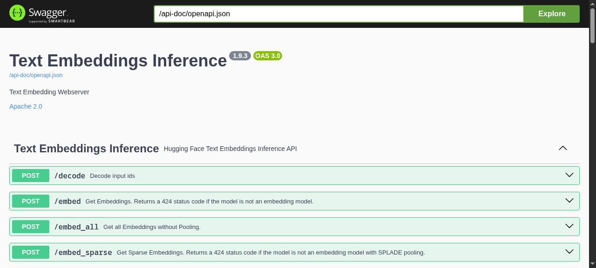

### [Text Embeddings Inference](https://github.com/huggingface/text-embeddings-inference)

> Handle: `tei`<br/>
> URL: [http://localhost:35030](http://localhost:35030)



Text Embeddings Inference (TEI) is Hugging Face's high-performance server for embedding, reranking and sequence-classification models. In Harbor it is the dedicated embeddings backend: RAG frontends and knowledge tools point at it over the internal network as `http://tei:80` instead of sharing an LLM backend for embeddings.

**Key Features:**
- **Fast**: Rust server with Candle backend, dynamic batching, no Python overhead
- **Small footprint**: the default model (`BAAI/bge-small-en-v1.5`) runs on CPU in well under 1 GB of RAM
- **OpenAI-compatible**: `/v1/embeddings` works with any client that accepts a custom base URL
- **Rerankers and classifiers**: serves `bge-reranker`-style cross-encoders via `/rerank` and classification models via `/predict`
- **Shared model cache**: downloads land in the standard Hugging Face hub layout, reused by other Harbor services
- **Swagger UI**: interactive API docs at `/docs`

#### Starting

```bash
# Pull the image
harbor pull tei

# Start TEI
harbor up tei

# Open in the browser (the API root is empty; the Swagger UI is at /docs)
harbor open tei
```

- On the first start the model is downloaded into the Hugging Face cache; the container reports healthy only once the model is loaded and answering `/health`
- Services that depend on `tei` wait for that healthy state, so a first run with a slow download can take a few minutes before dependents start

Quick check from the host:

```bash
curl http://localhost:35030/embed -H 'Content-Type: application/json' -d '{"inputs":"hello world"}'
curl http://localhost:35030/v1/embeddings -H 'Content-Type: application/json' -d '{"input":"hello world"}'
curl http://localhost:35030/info
```

`/info` reports the loaded model, its pooling and the max input length, which is useful when sizing chunks in a RAG tool.

#### Configuration

##### Environment Variables

Following options can be set via [`harbor config`](./3.-Harbor-CLI-Reference.md#harbor-config):

```bash
# Host port the API and Swagger UI are exposed on
HARBOR_TEI_HOST_PORT          35030

# Image and tag; the default tag is the CPU build
HARBOR_TEI_IMAGE              ghcr.io/huggingface/text-embeddings-inference
HARBOR_TEI_VERSION            cpu-latest

# Tag used instead when nvidia is part of the selection (harbor up tei nvidia)
HARBOR_TEI_VERSION_CUDA       latest

# Hugging Face model id (embedding, reranker or classifier)
HARBOR_TEI_MODEL              BAAI/bge-small-en-v1.5

# Extra CLI flags for text-embeddings-router, appended verbatim
# e.g. "--max-batch-tokens 32768 --pooling mean --auto-truncate false"
HARBOR_TEI_EXTRA_ARGS

# Max inputs accepted in one request (--max-client-batch-size; TEI's own
# default is 32). RAG tools send every chunk of a document in a single
# /v1/embeddings call, so this is sized for whole documents
HARBOR_TEI_MAX_CLIENT_BATCH_SIZE  512

# Shared with other services: Hugging Face token for gated models,
# passed into the container as HF_TOKEN
HARBOR_HF_TOKEN
```

Changing the model:

```bash
harbor config set tei.model BAAI/bge-m3
harbor up tei
```

Any model from the [supported list](https://github.com/huggingface/text-embeddings-inference#supported-models) works. Switching models changes the vector size, so every consumer with an existing index must re-embed before it can search again:

- **Open WebUI**: Admin > Settings > Documents > **Reset Vector Storage**, then re-upload documents to each Knowledge base
- **LibreChat**: delete and re-upload the agent's File Search files (existing vectors in `librechat-vector` keep the old size)
- **AnythingLLM**: Settings > Embedding Preference already reflects the new model; remove the workspace documents and add them again (the vector cache is purged on removal)
- **LightRAG**: set `lightrag.tei.embedding_dim` to the new model's dimension (`/info` reports it) and clear its storage, since LightRAG refuses to mix dimensions

##### GPU

Adding `nvidia` to the selection swaps to the CUDA image and reserves all NVIDIA GPUs:

```bash
harbor up tei nvidia
```

Pick a CUDA tag matching your GPU generation via `HARBOR_TEI_VERSION_CUDA` if the default `latest` (Ampere 80 / Hopper) doesn't match: `turing-latest` (T4, RTX 2000), `86-latest` (A10, A40, RTX 3000), `89-latest` (L4, RTX 4000), `hopper-latest` (H100), see the [image tags](https://github.com/huggingface/text-embeddings-inference/pkgs/container/text-embeddings-inference). There is no ROCm build of TEI, so on AMD/Intel/CPU-only hosts leave `nvidia` out of the selection: adding it makes Docker fail with `could not select device driver "nvidia" with capabilities: [[gpu]]` before the container starts (it stays in `Created`); run `harbor down tei` and start plain `harbor up tei` instead.

##### Volumes

- `${HARBOR_HF_CACHE}/hub` (default `~/.cache/huggingface/hub`) is mounted at `/data`, TEI's model cache. Models land in the standard `models--<org>--<name>` layout shared with vLLM, llama.cpp and other Harbor services that use the Hugging Face cache, so a model pulled once is never downloaded twice.
- `services/tei/override.env` holds per-service environment overrides (`harbor env tei`)

##### Ownership

TEI runs as your host user (`HARBOR_USER_ID:HARBOR_GROUP_ID`), so models it pulls into the shared hub cache stay owned by you and remain usable by `huggingface_hub` on the host (a root-run TEI leaves `root:root` `models--*` dirs whose `blobs/*.lock` files the host user cannot open). Because the image has no passwd entry for that uid, `HOME=/tmp` is set for the router. A `tei-init` sidecar (`services/tei/cache-init.sh`, mounted read-only at `/init.sh`) runs first against `${HARBOR_HF_CACHE}/hub` and re-owns exactly these paths, only where the owner is not already your uid:

- the `hub` directory itself, non-recursively (so TEI can create new `models--*` dirs there)
- everything under `models--*` (dirs a previous root-run container such as an older Harbor TEI, vLLM or TGI left root-owned)
- everything under `.locks`

Anything else in the shared cache (`datasets--*`, `spaces--*`, other tools' dirs, `version.txt`) is never visited. This is verified by `services/tei/check-cache-init.sh`, which runs the script against a fixture cache with a stubbed `chown` and asserts the exact set of touched paths. If a model directory is still not writable, run the sidecar by hand: `$(harbor cmd tei) run --rm tei-init`.

#### Integration with Harbor

TEI has no LLM of its own; its value is being the embeddings endpoint for other services. Cross-files wire it in automatically when both services are in the selection:

| Command | What happens |
|---|---|
| `harbor up webui tei` | Open WebUI's document RAG embeds with TEI: the cross-file renders `services/webui/configs/config.tei.json` (engine `openai`, base URL `http://tei:80/v1`, model `HARBOR_TEI_MODEL`) into Open WebUI's persisted config at every start, so it applies to existing installs as well as fresh ones |
| `harbor up librechat tei` | LibreChat's RAG API embeds with TEI through its `openai` provider (`RAG_OPENAI_BASEURL=http://tei:80/v1`, model `HARBOR_TEI_MODEL`); the bundled rag-api "lite" image lacks the native `huggingfacetei` provider's dependency, so the OpenAI-compatible route is used. Files reach the embedder only through the **Agents** endpoint's **File Search** capability (see below). Verify with `./services/tei/check-librechat-embed.sh` |
| `harbor up anythingllm tei` | AnythingLLM embeds with the `generic-openai` engine against `http://tei:80/v1`, model `HARBOR_TEI_MODEL`. AnythingLLM sends all chunks of a document in one request, which is why TEI runs with `--max-client-batch-size 512`. Verify with `./services/tei/check-anythingllm-embed.sh` |
| `harbor up lightrag tei` | LightRAG uses TEI for embeddings while its LLM binding stays on Ollama/llama.cpp |

Using it from Open WebUI (Knowledge):

1. `harbor up webui tei ollama` (or `llamacpp` for the chat model). Admin > Settings > Documents already shows the `openai` engine at `http://tei:80/v1` with `HARBOR_TEI_MODEL`, no manual change needed
2. Workspace > Knowledge > **+** to create a knowledge base, then **Add Content > Upload files**. Each file is chunked and embedded by TEI (`docker logs harbor.tei` shows an `openai_embed` line per upload; `harbor logs tei` tails, so prefer `docker logs`)
3. In a chat type `#` and pick the knowledge base (or attach it to a model under Workspace > Models); the reply shows **Retrieved N sources** with the matching chunks, and the query embedding shows up as another `openai_embed` line

Using it from AnythingLLM:

1. `harbor up anythingllm tei ollama`. Settings > Embedder shows **Generic OpenAI** at `http://tei:80/v1`
2. Create a workspace and open its settings > **Chat Settings** > **Workspace LLM Provider** / **Select Model** to pick the chat model (Ollama or llama.cpp; the embedder is set globally and needs no per-workspace choice)
3. Open the workspace's document manager, upload a file and **Move to Workspace > Save and Embed**, or drag a file into the chat. One `/v1/embeddings` request carries every chunk of the file (a 3,000-word document is 50+ inputs); TEI logs a single `openai_embed` line and the document appears under the workspace
4. Chat in the workspace; the retrieved chunks are listed as citations under the reply

Using it from LibreChat (Agents endpoint, File Search):

1. `harbor up librechat tei` (add `ollama` or `llamacpp` for the chat model; see the LibreChat doc for creating a user, registration is disabled)
2. In LibreChat pick the **Agents** endpoint and open the agent builder; choose a provider and model (e.g. Ollama), enable **File Search** under capabilities, and upload a document under **File Search**. Each upload is chunked and embedded by TEI (`docker logs harbor.tei` shows an `openai_embed` line per chunk batch)
3. Chat with the agent; when it calls the `file_search` tool your question is embedded by TEI and matched against the uploaded chunks, and the answer cites the file

Attaching a file in a plain (non-agent) chat on a custom endpoint offers only "Upload as Text" / "Upload to Provider" and never embeds, so TEI is not involved there. `check-librechat-embed.sh` drives the same `POST /api/files` upload (`endpoint=agents`, `tool_resource=file_search`) that the agent builder sends, with a throwaway user and agent it removes afterwards.

Notes:
- Open WebUI keeps `RAG_*` settings in its database, so the cross-file does not rely on env vars alone; each `harbor up webui tei` re-applies the TEI embedder, and running Open WebUI without `tei` leaves the last persisted embedder in place (change it under Admin > Settings > Documents if needed). Verify on a running stack with `./services/tei/check-webui-embed.sh` (or `./services/tei/check-librechat-embed.sh` for LibreChat's agent File Search path), which upload a file and confirm an `openai_embed` request in TEI's log
- Dependents declare `condition: service_healthy` on `tei`, so they start only after the model is loaded
- Cross-files are applied in alphabetical order, independent of the order of the `harbor up` arguments. When both an LLM backend cross-file and the TEI cross-file set the embedder (e.g. `harbor up anythingllm ollama tei`), `compose.x.anythingllm.tei.yml` sorts after `compose.x.anythingllm.ollama.yml`, so TEI is the embedder
- Any other service with an OpenAI-compatible embeddings setting can use `http://tei:80/v1` (any API key value is accepted) and `HARBOR_TEI_MODEL` as the model name

#### Troubleshooting

##### Check Logs

```bash
harbor logs tei
```

- `harbor logs tei` follows the log; use `docker logs harbor.tei` for a one-shot dump
- Startup takes a while the first time: the model is downloaded and converted. Wait until the log shows `Ready`
- `Backend does not support a batch size > 8` on CPU is informational; use the CUDA image for larger batches
- Every embedding request logs one `openai_embed` (or `embed`) line with its timing, so a RAG tool's uploads are easy to trace

##### Model won't load

- Models without a `pooling` config need `--pooling mean|cls` in `HARBOR_TEI_EXTRA_ARGS`
- Gated models return `401`/`403` on download until `HARBOR_HF_TOKEN` is set
- A `424` response from `/embed` means the loaded model is not an embedding model (e.g. a reranker); use `/rerank` or `/predict` instead

##### `batch size N > maximum allowed batch size` (422)

TEI caps the number of inputs per request with `--max-client-batch-size`. Harbor sets it to 512 (`HARBOR_TEI_MAX_CLIENT_BATCH_SIZE`) because RAG tools such as AnythingLLM send every chunk of a document in one `/v1/embeddings` call; with TEI's stock default of 32 a 3,000-word document (50+ chunks) is rejected with `422 batch size 53 > maximum allowed batch size 32` and AnythingLLM logs `Failed to vectorize`, leaving the workspace with 0 documents. If you lowered the value, raise it again, or cap the client side instead (AnythingLLM: `GENERIC_OPEN_AI_EMBEDDING_MAX_CONCURRENT_CHUNKS=32` via `harbor env anythingllm`). `./services/tei/check-anythingllm-embed.sh` reproduces the whole-document ingest and fails on this 422.

##### Inputs too long

Inputs above the model's `max_input_length` (`/info`) are truncated silently: the `cpu-latest` / CUDA `latest` tags default `--auto-truncate` to on (`/info` reports `"auto_truncate":true`). To fail loudly instead, add `--auto-truncate false` to `HARBOR_TEI_EXTRA_ARGS`; too-long inputs are then rejected with `422 inputs must have less than 512 tokens`, and the fix is a smaller chunk size in the calling RAG tool.

#### Links

- [TEI Documentation](https://huggingface.co/docs/text-embeddings-inference)
- [Supported models](https://github.com/huggingface/text-embeddings-inference#supported-models)
- [GitHub Repository](https://github.com/huggingface/text-embeddings-inference)
