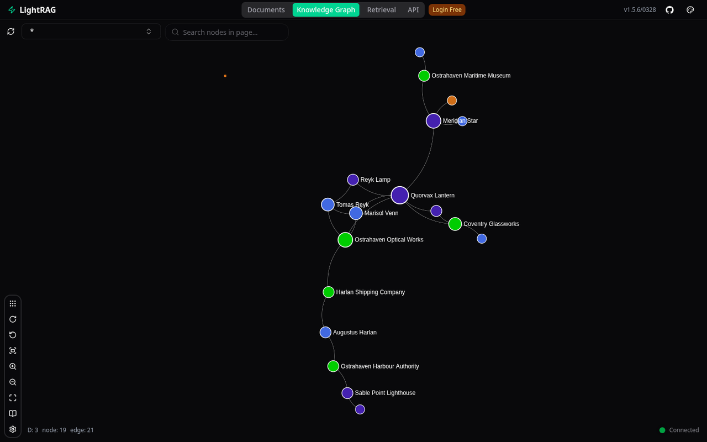

### [LightRAG](https://github.com/HKUDS/LightRAG)

> Handle: `lightrag`<br/>
> URL: [http://localhost:35040](http://localhost:35040)



LightRAG is a graph-based Retrieval-Augmented Generation server. It ingests documents, extracts entities and relations into a knowledge graph, and answers questions with `naive`, `local`, `global`, `hybrid` or `mix` retrieval. In Harbor it runs against your local backends and can be chatted with as a "model" from Open WebUI.

**Key Features:**
- **Knowledge graph RAG**: entities and relations are extracted at ingest time and traversed at query time, not just chunk similarity
- **Web UI**: upload and scan documents, watch ingestion status, explore the graph, run queries
- **REST API**: `/documents/*`, `/query`, `/graphs` with an OpenAPI page at `/docs`
- **Ollama-compatible API**: `/api/chat` and `/api/tags` expose the knowledge base as a model named `lightrag:latest` (`lightrag.lightrag:latest` once prefixed by Open WebUI)
- **Local backends**: LLM and embeddings from Ollama, llama.cpp or text-embeddings-inference, wired automatically by Harbor cross-files

#### Starting

```bash
# Pull the image
harbor pull lightrag

# Start with Ollama providing both the LLM and the embeddings
harbor up lightrag ollama --open
```

- On first load, the web UI asks for an API key: enter the value of `HARBOR_LIGHTRAG_API_KEY` (default `sk-lightrag`). API calls send it as the `X-API-Key` header; only `/health` is unauthenticated.
- The Ollama cross-file uses `qwen3.5:4b` for the LLM and `nomic-embed-text` for embeddings by default. On every start the `lightrag` container first pulls both models and derives two copies of the LLM, `lightrag/qwen3.5:4b` and `lightrag/qwen3.5:4b-query` (they share the base model's blobs on disk; see [Backends](#backends) for why there are two), then launches the server; `harbor logs lightrag` shows the `Harbor: lightrag ollama init` lines. The container stays `starting` until the pulls are done (up to 30 minutes are allowed on first start).
- LightRAG needs a real embedder. `harbor up lightrag llamacpp` on its own gets an LLM but no embeddings (the llama.cpp router does not serve them); pair it with `ollama` or `tei`.

##### First ingest and query

```bash
# Add a text document (the UI can also upload files)
curl -H "X-API-Key: sk-lightrag" -H "Content-Type: application/json" \
  -X POST http://localhost:35040/documents/text \
  -d '{"text":"The Quorvax Lantern was designed by Mira Oduya.","file_source":"note.txt"}'

# Wait for the document to reach "processed"
curl -H "X-API-Key: sk-lightrag" http://localhost:35040/documents

# Ask a question against the knowledge base
curl -H "X-API-Key: sk-lightrag" -H "Content-Type: application/json" \
  -X POST http://localhost:35040/query \
  -d '{"query":"Who designed the Quorvax Lantern?","mode":"hybrid"}'
```

Files dropped into `services/lightrag/data/inputs/` are picked up by the "Scan" button in the UI.

Stop with `harbor down lightrag`. Note that `harbor down <service>` also stops the other services from the same `harbor up` set (Ollama included); start them again with `harbor up` if something else needs them.

After you enter the API key, the **Documents** tab keeps showing `No Documents` / `All (0)` on a populated knowledge base until you reload the page; the list was fetched once before the key was set and is not refetched. The **Knowledge Graph** tab loads the graph once per label and caches the result. If it was opened before the API key was entered, or before an ingest finished, it keeps showing `node: 0`; pick the label again from the dropdown or reload the page to fetch the graph that `GET /graphs` already returns. This is upstream UI behaviour, not a Harbor setting.

#### Configuration

##### Backends

Harbor selects the LLM and embedding provider from the services you start alongside `lightrag`:

| Command | LLM | Embeddings |
|---|---|---|
| `harbor up lightrag ollama` | Ollama, `lightrag/<HARBOR_LIGHTRAG_OLLAMA_MODEL>` and `-query` | Ollama, `HARBOR_LIGHTRAG_OLLAMA_EMBEDDING_MODEL` |
| `harbor up lightrag ollama tei` | Ollama | [TEI](./2.2.26-Backend-Text-Embeddings-Inference.md), `HARBOR_TEI_MODEL` |
| `harbor up lightrag llamacpp tei` (experimental) ingest works, most answers come back as keyword JSON | llama.cpp, `HARBOR_LIGHTRAG_LLAMACPP_MODEL` | TEI |
| `harbor up lightrag llamacpp ollama` (experimental) same answer problem | llama.cpp | Ollama |
| `harbor up lightrag` | `HARBOR_LIGHTRAG_OPENAI_URL` + `HARBOR_LIGHTRAG_MODEL` | same endpoint, `HARBOR_LIGHTRAG_EMBEDDING_MODEL` |

When TEI provides embeddings, `HARBOR_LIGHTRAG_TEI_EMBEDDING_DIM` must match the TEI model's vector size (384 for the default `BAAI/bge-small-en-v1.5`). Without any cross-file, LightRAG talks to a generic OpenAI-compatible endpoint configured by the `HARBOR_LIGHTRAG_OPENAI_*` and `HARBOR_LIGHTRAG_MODEL`/`HARBOR_LIGHTRAG_EMBEDDING_MODEL` variables.

Harbor runs entity extraction in LightRAG's JSON mode (`HARBOR_LIGHTRAG_EXTRACTION_JSON=true`). The default delimiter-based mode expects `<|>`/`##` separated records that most local models never produce, which ends in `0 Ent + 0 Rel`, an empty Knowledge Graph tab and `[no-context]` answers in graph modes. In JSON mode the shipped `qwen3.5:4b` and `unsloth/Qwen3.5-4B-GGUF:Q4_K_M` defaults both build a usable graph from a short document; larger models extract more and better-described relations. Reranking is off (`HARBOR_LIGHTRAG_RERANK_BY_DEFAULT=false`) unless you configure a rerank model.

**Ollama is the recommended LLM backend, and the only one Harbor's runtime check passes on.** `./services/lightrag/check-graph.sh --stack ollama` ingests a paragraph, asks five different hybrid-mode questions about it and then deletes the paragraph again (`DELETE /documents/delete_document`), comparing the document list against a snapshot taken before ingest so your knowledge base is left exactly as it was found. An answer only counts when it names the expected entity and does not hedge that the fact is unknown, fictional or unsupported ("there is no record of…" fails); at least four of five must pass. Measured on the shipped defaults: 5 of 5 consecutive runs on an empty knowledge base passed with 25 of 25 answers grounded, and a sixth run next to a user document passed 4 of 5; after each run the document list matched the snapshot.

A one-paragraph knowledge base is not what a real one looks like, so `check-graph.sh --stack ollama --corpus` ingests five one-line notes plus a 3,600-word history that LightRAG splits into four chunks, then asks five questions that span the notes and different chunks of the long file, in `hybrid` and again in `naive` mode (same grading, at most one miss per mode), and deletes all six documents again. Before the settings described below, this corpus scored 0 of 8 hybrid and 0 of 8 naive on the shipped 4B model (and 0 of 8 both ways on `qwen3.5:9b`): retrieval was fine (`only_need_context: true` showed the right passages) but the model answered from the wrong document or claimed the fact was not mentioned. With the shipped settings the same corpus, next to five unrelated user documents, scored: 4 of 4 consecutive runs passed: 18 of 20 hybrid answers grounded (5/5, 4/5, 4/5, 5/5) and 16 of 20 naive (4/5 each; the naive miss is always the pilot question, whose chunk naive retrieval ranks below the top 5), knowledge base restored after each run. Ingesting the corpus takes about 3 minutes and each answer 30 to 60 s while the query copy runs on CPU (see below). If your `Documents` tab lists `harbor-check-<timestamp>*.txt` entries, a check was interrupted: delete them there (deleting many at once triggers a long entity rebuild), or stop LightRAG and remove `services/lightrag/data/rag_storage/ollama` to start over. The llama.cpp path is experimental and does not pass the check: on `harbor up lightrag llamacpp tei` with the shipped defaults, 3 of 3 consecutive runs failed with 2 of 15 answers grounded and 13 returned as keyword or entity JSON; ingest itself works (about 30 s per paragraph). Details under [Troubleshooting](#graph-mode-answers-come-back-as-high_level_keywords--or-entities--json).

How the Ollama path is wired, and why:

- LightRAG talks to Ollama through its OpenAI-compatible `/v1` endpoint (`LLM_BINDING=openai`) instead of the native binding, because `/v1` is the only route that accepts `reasoning_effort`, and `HARBOR_LIGHTRAG_OLLAMA_REASONING_EFFORT=none` is how Qwen3-style thinking is turned off in Ollama. With thinking on, a 4B model burns thousands of reasoning tokens per JSON-mode extraction call and runs into LightRAG's per-call timeout (an 8-minute ingest that then fails). Embeddings still use the native binding.
- `/v1` ignores per-request `num_ctx`, so `services/lightrag/ollama-init.sh`, which wraps the image entrypoint on this path, derives `lightrag/<model>` (`HARBOR_LIGHTRAG_OLLAMA_EXTRACT_NUM_CTX`, default 16384) and `lightrag/<model>-query` (`HARBOR_LIGHTRAG_OLLAMA_NUM_CTX`, default 32768) from `HARBOR_LIGHTRAG_OLLAMA_MODEL` with the context size baked in. Ollama's default context (`HARBOR_OLLAMA_CONTEXT_LENGTH`, 4096) is far too small for LightRAG's prompts.
- Extraction and keyword calls use `lightrag/<model>`; query answers use `lightrag/<model>-query` (`QUERY_LLM_MODEL`). The two names have different parameters, so Ollama gives them separate runners. This is the mitigation for the keyword/extraction JSON answers described in Troubleshooting: on Harbor's ROCm Ollama build, a long, loosely constrained answer prompt that follows a JSON-mode request on the same runner comes back as that JSON. With the split, no JSON-mode request ever precedes an answer on the runner that produces it. Ollama swaps the two runners in and out as roles alternate (about a second for a 4B model), so this does not double VRAM use.
- `HARBOR_LIGHTRAG_OLLAMA_MAX_TOKENS` caps each completion and `HARBOR_LIGHTRAG_OLLAMA_TIMEOUT` bounds each call, so a runaway generation frees the runner instead of hanging an ingest.
- One LLM call at a time (`HARBOR_LIGHTRAG_OLLAMA_MAX_ASYNC=1`, `MAX_PARALLEL_INSERT=1`). Ollama serves one request per runner, and LightRAG's default fan-out (4 calls x 3 parallel inserts) only queues the extraction calls of a multi-chunk file until one of them trips the 360 s worker timeout: a 3,000-word file failed with `extract LLM func: Worker execution timeout after 360s` on chunk 3 of 4 every time, and ingests in about 3 minutes serialized.
- A small answer prompt (`HARBOR_LIGHTRAG_OLLAMA_TOP_K=10`, `HARBOR_LIGHTRAG_OLLAMA_CHUNK_TOP_K=5`, `HARBOR_LIGHTRAG_OLLAMA_MAX_TOTAL_TOKENS=8000`). LightRAG's own defaults (40 / 20 / 30000) turn every question into a 25-60K-character prompt once the knowledge base holds more than a few notes, and a 4B model then answers from whichever document it fixates on. Raise these if you run a much larger model. **These env values only govern requests that do not set the fields themselves: `POST /query` from curl and the Open WebUI/Ollama-compatible chat route.** The web UI's **Retrieval** tab sends every field from its own **Parameters** panel, whose defaults are hardcoded in the frontend and stored in your browser (`KG Top K 40`, `Chunk Top K 20`, `Max Entity/Relation Tokens 6000/8000`, `Max Total Tokens 30000`, `Enable Rerank` on); the server has no setting that changes them, so a UI query runs with `top_k:40, chunk_top_k:20` and logs `Rerank is enabled but no rerank model is configured` regardless of `HARBOR_LIGHTRAG_*`. For UI queries open the Parameters panel once and set `KG Top K 10`, `Chunk Top K 5`, `Max Total Tokens 8000` and untick `Enable Rerank`; the browser remembers the values.
- The derived `lightrag/<model>` and `lightrag/<model>-query` copies are regular Ollama models, so they appear in the model list of every Ollama client (Open WebUI included; pick the base model there, the copies only differ in `num_ctx`/`num_gpu`). On each start `ollama-init.sh` removes any other `lightrag/*` model, so copies left over from a previous `HARBOR_LIGHTRAG_OLLAMA_MODEL` do not accumulate; to remove the current pair by hand after `harbor down lightrag`, run `harbor ollama rm lightrag/qwen3.5:4b lightrag/qwen3.5:4b-query`.
- On ROCm hosts `compose.x.lightrag.ollama.rocm.yml` bakes `num_gpu=0` into `lightrag/<model>-query` (`HARBOR_LIGHTRAG_OLLAMA_ROCM_QUERY_NUM_GPU`), so query answers run on CPU while extraction stays on the GPU. Harbor's ROCm Ollama build (`ollama/ollama:rocm` 0.32) answers a 2,500-token prompt that literally contains "Biscuit was adopted from the Fenwick Lane shelter" with "there is no mention of a cat named Biscuit" on the GPU, from a freshly loaded runner and with 4B and 9B models alike, while the identical request with `num_gpu: 0` answers correctly; this is not the request-ordering bug above. A 4B answer takes 30 to 60 s on CPU. Set `HARBOR_LIGHTRAG_OLLAMA_ROCM_QUERY_NUM_GPU=-1` to put it back on the GPU if your ROCm build does not have this problem; on CUDA and CPU hosts the query copy uses Ollama's default placement (`HARBOR_LIGHTRAG_OLLAMA_QUERY_NUM_GPU=-1`).

The llama.cpp cross-files disable Qwen3-style thinking (`HARBOR_LIGHTRAG_LLAMACPP_THINKING=false`) for the same reason. They also run one LLM call at a time (`HARBOR_LIGHTRAG_LLAMACPP_MAX_ASYNC=1`, `MAX_PARALLEL_INSERT=1`) with a 180 s per-call timeout and a 4096-token completion cap: `llama-server` serves a single model with a few slots, and LightRAG's default fan-out of 4 async calls x 2 parallel inserts otherwise queues extraction workers into its 480 s worker timeout, turning a one-paragraph ingest into an 8-minute wait. With these limits the same paragraph ingests in about 30 s.

##### Environment Variables

Following options can be set via [`harbor config`](./3.-Harbor-CLI-Reference.md#harbor-config):

```bash
# Host port for the UI and API
HARBOR_LIGHTRAG_HOST_PORT              35040

# Image
HARBOR_LIGHTRAG_IMAGE                  ghcr.io/hkuds/lightrag
HARBOR_LIGHTRAG_VERSION                latest

# Persistent data root (mounted at /app/data)
HARBOR_LIGHTRAG_WORKSPACE              ./services/lightrag/data

# X-API-Key for the UI, the REST API and the Ollama-compatible API
HARBOR_LIGHTRAG_API_KEY                sk-lightrag

# Standalone OpenAI-compatible endpoint, used when no backend cross-file applies
HARBOR_LIGHTRAG_OPENAI_URL             http://llamacpp:8080/v1
HARBOR_LIGHTRAG_OPENAI_KEY             sk-lightrag
HARBOR_LIGHTRAG_MODEL                  (LLM model name)
HARBOR_LIGHTRAG_EMBEDDING_MODEL        (embedding model name)
HARBOR_LIGHTRAG_EMBEDDING_DIM          768

# JSON structured entity extraction (the delimiter mode yields 0 entities with most local models)
HARBOR_LIGHTRAG_EXTRACTION_JSON        true

# Rerank retrieved chunks by default; keep false unless a rerank model is configured
HARBOR_LIGHTRAG_RERANK_BY_DEFAULT      false

# Optional reranker: null, cohere, jina or aliyun
HARBOR_LIGHTRAG_RERANK_BINDING         null
HARBOR_LIGHTRAG_RERANK_URL
HARBOR_LIGHTRAG_RERANK_MODEL

# harbor up lightrag ollama: base model pulled and derived at container start
HARBOR_LIGHTRAG_OLLAMA_MODEL           qwen3.5:4b
# Context of lightrag/<model>-query (answers) and lightrag/<model> (extraction)
HARBOR_LIGHTRAG_OLLAMA_NUM_CTX         32768
HARBOR_LIGHTRAG_OLLAMA_EXTRACT_NUM_CTX 16384
# reasoning_effort sent to Ollama's /v1; "none" turns Qwen3-style thinking off
HARBOR_LIGHTRAG_OLLAMA_REASONING_EFFORT none
# Completion cap and per-call timeout (s) against Ollama
HARBOR_LIGHTRAG_OLLAMA_MAX_TOKENS      4096
HARBOR_LIGHTRAG_OLLAMA_TIMEOUT         180
# In-flight LLM call limit; multi-chunk files hit the worker timeout above 1
HARBOR_LIGHTRAG_OLLAMA_MAX_ASYNC       1
# Answer prompt budget: entities/relations, chunks, total tokens
HARBOR_LIGHTRAG_OLLAMA_TOP_K           10
HARBOR_LIGHTRAG_OLLAMA_CHUNK_TOP_K     5
HARBOR_LIGHTRAG_OLLAMA_MAX_TOTAL_TOKENS 8000
# num_gpu of lightrag/<model>-query (-1: Ollama default); the ROCm cross-file uses the _ROCM_ value
HARBOR_LIGHTRAG_OLLAMA_QUERY_NUM_GPU   -1
HARBOR_LIGHTRAG_OLLAMA_ROCM_QUERY_NUM_GPU 0
HARBOR_LIGHTRAG_OLLAMA_EMBEDDING_MODEL nomic-embed-text:latest
HARBOR_LIGHTRAG_OLLAMA_EMBEDDING_DIM   768

# harbor up lightrag llamacpp ...
HARBOR_LIGHTRAG_LLAMACPP_MODEL         unsloth/Qwen3.5-4B-GGUF:Q4_K_M
# Send chat_template_kwargs.enable_thinking to llama.cpp (Qwen3 family)
HARBOR_LIGHTRAG_LLAMACPP_THINKING      false
# Completion cap, per-call timeout (s) and in-flight call limit against llama-server
HARBOR_LIGHTRAG_LLAMACPP_MAX_TOKENS    4096
HARBOR_LIGHTRAG_LLAMACPP_TIMEOUT       180
HARBOR_LIGHTRAG_LLAMACPP_MAX_ASYNC     1

# harbor up lightrag tei
HARBOR_LIGHTRAG_TEI_EMBEDDING_DIM      384
```

##### Volumes

`HARBOR_LIGHTRAG_WORKSPACE` is mounted at `/app/data`. LightRAG runs as your host user and the `lightrag-init` sidecar chowns the workspace to `HARBOR_USER_ID:HARBOR_GROUP_ID` before every start, so everything below stays manageable without `sudo`:

- `services/lightrag/data/rag_storage/<embedder>/` - knowledge graph, vector and KV stores; one directory per embedding source (`ollama`, `tei`, `openai`), so switching backends never mixes vectors of different sizes
- `services/lightrag/data/inputs/` - drop documents here for the "Scan" button
- `services/lightrag/data/prompts/` - custom prompt overrides (`PROMPT_DIR`; created empty by `lightrag-init`)
- `services/lightrag/data/tiktoken/` - tokenizer cache

#### Integration with Harbor

##### Open WebUI

```bash
harbor up lightrag ollama webui
```

Open WebUI lists a `lightrag.lightrag:latest` model (the `lightrag` connection prefix plus LightRAG's own `lightrag:latest`) backed by LightRAG's Ollama-compatible endpoint. Chatting with it answers from the ingested knowledge base; prefix a message with `/naive`, `/local`, `/global`, `/hybrid` or `/mix` to pick the retrieval mode, or `/bypass` to talk to the LLM directly. Harbor sends `HARBOR_LIGHTRAG_API_KEY` as a per-connection header and whitelists the read-only listing routes (`/api/tags`, `/api/version`, `/api/ps`) because Open WebUI only sends a Bearer token there, which LightRAG does not accept. Chat and document routes stay key-protected.

##### Traefik

With `harbor up lightrag ollama traefik`, LightRAG is also served at `https://lightrag.<HARBOR_TRAEFIK_DOMAIN>` (`compose.x.traefik.lightrag.yml`). The API key prompt and the `X-API-Key` header work the same through the proxy.

##### Other clients

Any Ollama client can use the same endpoint at `http://localhost:35040` (or `http://lightrag:9621` inside the Harbor network) with the `X-API-Key` header, and any HTTP client can call the REST API described at [http://localhost:35040/docs](http://localhost:35040/docs).

#### Troubleshooting

##### Check Logs

```bash
harbor logs lightrag
```

##### `403 API Key required`

Enter `HARBOR_LIGHTRAG_API_KEY` in the UI key prompt, or add the `X-API-Key` header to API calls. Note that a `Bearer` token is not accepted in place of the key.

##### `[no-context]` answers in hybrid/local/global mode

The knowledge graph is empty: `harbor logs lightrag` shows `extracted 0 Ent + 0 Rel` or `Complete delimiter can not be found in extraction result`. Make sure `HARBOR_LIGHTRAG_EXTRACTION_JSON` is still `true` (JSON mode is the Harbor default) and that the LLM is one that reliably returns JSON; then re-ingest, since documents processed while extraction was failing stay at 0 entities. `naive` mode keeps working from chunk similarity alone.

##### Graph-mode answers come back as `{"high_level_keywords": ...}` or `{"entities": ...}` JSON

LightRAG makes two LLM calls per graph-mode query: a keyword-extraction call in JSON mode, then the answer call with a long prompt that is mostly JSON records (the retrieved entities, relations and chunks). What Harbor observed on its ROCm builds of both `llama-server` and Ollama (`ollama/ollama:rocm` 0.32) with Qwen3.5-4B: an answer call that runs on the same runner right after a JSON-mode call returns that JSON instead of an answer. Replaying the identical answer request against a freshly loaded runner, or after a prose request, gives a normal answer; running the same sequence on CPU (`num_gpu: 0`) never reproduces it. It is not the prompt cache (the answer prompt is fully re-evaluated) and not sampling (it reproduces at temperature 0.1), so Harbor treats it as a backend bug and works around it:

- `harbor up lightrag ollama` puts query answers on their own derived model (`lightrag/<model>-query`, see [Backends](#backends)), so an answer never follows a JSON-mode call on its runner. Result on shipped defaults with the strict grader: 5 of 5 consecutive `check-graph.sh --stack ollama` runs passed with 25 of 25 hybrid answers grounded and none of them JSON; a further run next to an unrelated user document scored 4 of 5. If you set `QUERY_LLM_MODEL` back to the extraction model, expect 0 to 2 grounded answers out of 5.
- `harbor up lightrag llamacpp tei` cannot split roles the same way (the router serves one model per name, and this LightRAG image has no separate query-model setting), which is why it stays experimental. Ingest works (`check-graph.sh --stack llamacpp --ingest-only`, about 30 s per paragraph), but answers mostly do not: measured on the shipped defaults (`unsloth/Qwen3.5-4B-GGUF:Q4_K_M`, ROCm `llama-server`, serialized calls), 3 of 3 consecutive `check-graph.sh --stack llamacpp` runs failed with 2 of 15 hybrid answers grounded and 13 returned as `{"high_level_keywords": ...}` or `{"entities": ...}` JSON, and 15 ad-hoc questions about a freshly ingested paragraph came back as keyword JSON in 14 cases across every mode (`naive`, `local`, `global`, `hybrid`, `mix`), so `naive` is not a workaround. The cause is the model, not request ordering: the same answer prompt sent straight to `llama-server` as a fresh request, with `cache_prompt: false`, still returned keyword JSON 2 times out of 3 even though the prompt contains no such schema; the 4B model reproduces the LightRAG keyword format on sight of the LightRAG answer prompt. Shrinking the context (`TOP_K`, `MAX_TOTAL_TOKENS`), disabling llama.cpp's prompt cache and swapping in a 7B Qwen2.5 GGUF (which returned garbled text on this ROCm build) did not change the outcome, and a `grammar` that forbids a leading `{` cannot be set globally because llama.cpp lets it override the `json_object` mode the keyword and extraction calls depend on. Use `harbor up lightrag ollama` for answers.
- Small models add a second failure mode on ROCm Ollama: `qwen2.5:1.5b`, `qwen3:0.6b` and other sub-2B models return garbage tokens for any prompt above roughly 4k tokens, which is every graph-mode answer prompt. The previous `qwen2.5:1.5b` default was hit by this; stay at 4B or larger.

##### Answers say "there is no mention of …" or cite the wrong document although the fact is in the knowledge base

Check retrieval first: repeat the query with `"only_need_context": true`; if the passage is in the returned context, the answer model is the problem, not the graph. Two causes Harbor measured on `harbor up lightrag ollama`:

- The prompt is too big for the model. With LightRAG's own defaults a knowledge base of ten small files already produces 25-60K-character prompts, on which `qwen3.5:4b` and `qwen3.5:9b` both scored 0 of 8 on a mixed corpus. Harbor ships `HARBOR_LIGHTRAG_OLLAMA_TOP_K=10`, `CHUNK_TOP_K=5` and `MAX_TOTAL_TOKENS=8000` for `POST /query` and Open WebUI; if you raised them, lower them again. The web UI's Retrieval tab ignores these and uses its own Parameters panel (upstream defaults 40 / 20 / 30000 with rerank on, see [Backends](#backends)): set `KG Top K 10`, `Chunk Top K 5`, `Max Total Tokens 8000` and untick `Enable Rerank` there. `harbor logs lightrag` shows the values actually used (`top_k:40, chunk_top_k:20` means the UI defaults are in effect).
- ROCm Ollama on the GPU. Harbor's ROCm build returns wrong answers for prompts of a few thousand tokens that the same model answers correctly on CPU (details under [Backends](#backends)); Harbor moves the query copy to CPU on ROCm hosts. If you set `HARBOR_LIGHTRAG_OLLAMA_ROCM_QUERY_NUM_GPU=-1`, expect this failure.

`./services/lightrag/check-graph.sh --stack ollama --corpus` reproduces the mixed-corpus measurement on your host.

##### Ingest of a longer file fails with `Worker execution timeout after 360s`

`harbor logs lightrag` shows `C[1/4]: doc-…-chunk-003: extract LLM func: Worker execution timeout after 360s` and the `Documents` tab lists the file as failed. More extraction calls were in flight than the backend serves at once, so the queued ones waited past LightRAG's worker timeout. On the Ollama path `HARBOR_LIGHTRAG_OLLAMA_MAX_ASYNC=1` prevents this; if you raised it, lower it and use "Retry failed" in the UI (or delete and re-upload the file).

##### `Embedding dim mismatch, expected: N, but loaded: M`

The embedding model changed after data was ingested. Harbor keeps one store per embedding source (`rag_storage/ollama`, `rag_storage/tei`, `rag_storage/openai`), so this only happens when you change `HARBOR_TEI_MODEL` or `HARBOR_LIGHTRAG_OLLAMA_EMBEDDING_MODEL` in place. Stop the service, delete the affected `services/lightrag/data/rag_storage/<embedder>` directory, start it again and re-ingest.

##### Ingest stuck in `processing`

Entity extraction makes many LLM calls per document; with a small CPU-bound model a single page can take minutes. Check `harbor logs ollama` (or `llamacpp`) for activity. On the Ollama path, the first lines of `harbor logs lightrag` (`Harbor: lightrag ollama init - ...`) show whether the model pull and the derived-model creation succeeded; if `HARBOR_LIGHTRAG_OLLAMA_MODEL` names a model that does not exist in the Ollama library, the container exits with the Ollama error before the server starts. Ingest calls that time out with `httpx.ReadTimeout` after several minutes mean the model is thinking: check that `HARBOR_LIGHTRAG_OLLAMA_REASONING_EFFORT` is still `none`.

#### Links

- [LightRAG Documentation](https://github.com/HKUDS/LightRAG#readme)
- [Server & API Reference](https://github.com/HKUDS/LightRAG/blob/main/lightrag/api/README.md)
- [Paper](https://arxiv.org/abs/2410.05779)
- [GitHub Repository](https://github.com/HKUDS/LightRAG)
