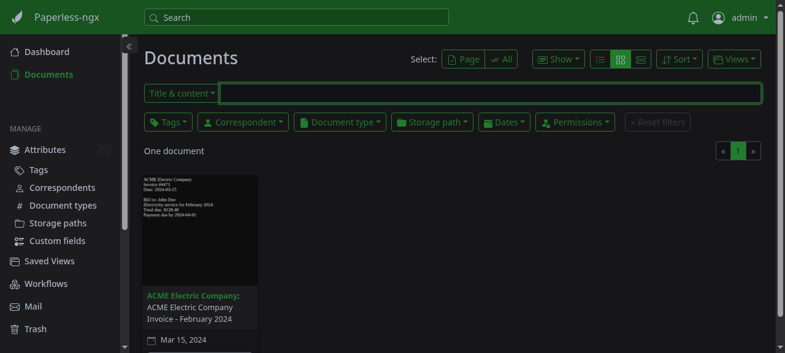

### [Paperless-ngx](https://github.com/paperless-ngx/paperless-ngx)

> Handle: `paperless`<br/>
> URL: [http://localhost:35050](http://localhost:35050)

Paperless-ngx is a document management system that ingests scans, PDFs and office files, runs OCR on them, and turns them into a searchable, tagged archive. In Harbor it is the document store that [Paperless-GPT](./2.3.95-Satellite-Paperless-GPT.md) enriches with LLM-generated titles, tags and correspondents.



**Key Features:**
- **OCR pipeline**: Tesseract OCR with configurable languages, producing searchable archived PDFs
- **Auto-import**: watches a consume folder, accepts uploads via UI, API and email
- **Organisation**: tags, correspondents, document types, storage paths and custom fields
- **Machine learning**: learns to auto-assign tags and correspondents from your corrections
- **Full-text search**: Whoosh index with similarity search across all document content
- **REST API**: everything the UI does is available under `/api/`

#### Starting

```bash
harbor pull paperless
harbor up paperless --open
```

Log in with `admin` / `admin`. Change it before exposing the service beyond your machine (`harbor config set paperless.admin_password <new>`, then restart `paperless` - the change also applies to an existing stack). Also change `HARBOR_PAPERLESS_SECRET_KEY` from its default `harbor-paperless-secret-key`, it signs sessions. The stack is three containers: `paperless` (web server, consumer, celery worker), `paperless-valkey` (task broker) and the short-lived `paperless-init` sidecar (workspace ownership). The database is SQLite stored under the data volume.

To import a document, either upload it in the UI, drop it into `services/paperless/data/consume/`, or post it to the API:

```bash
curl -u admin:admin -F "document=@invoice.pdf" http://localhost:35050/api/documents/post_document/
```

To use local LLMs for titles, tags, correspondents and OCR, start it together with Paperless-GPT and a backend:

```bash
harbor up paperless paperless-gpt ollama
```

#### Configuration

##### Environment Variables

Following options can be set via [`harbor config`](./3.-Harbor-CLI-Reference.md#harbor-config):

```bash
# Host port for the web UI / API
HARBOR_PAPERLESS_HOST_PORT          35050

# Image and tag
HARBOR_PAPERLESS_IMAGE              ghcr.io/paperless-ngx/paperless-ngx
HARBOR_PAPERLESS_VERSION            latest

# Valkey task broker
HARBOR_PAPERLESS_VALKEY_IMAGE       valkey/valkey
HARBOR_PAPERLESS_VALKEY_VERSION     9-alpine

# Root for data/, media/, consume/, export/ and valkey/
HARBOR_PAPERLESS_WORKSPACE          ./services/paperless/data

# Public URL, used for CSRF and for links; change when exposed via a different
# host. When traefik is selected, services/compose.x.paperless.traefik.yml
# overrides it with https://paperless.<HARBOR_TRAEFIK_DOMAIN> and keeps this
# value trusted via PAPERLESS_CSRF_TRUSTED_ORIGINS
HARBOR_PAPERLESS_URL                http://localhost:35050

# Django secret key - change for any non-local deployment
HARBOR_PAPERLESS_SECRET_KEY         harbor-paperless-secret-key

# Superuser credentials. Default admin / admin - change before exposing
# Paperless beyond localhost. Applied on every start: changing the password
# here updates the existing user (services/paperless/sync-admin-password.sh)
HARBOR_PAPERLESS_ADMIN_USER         admin
HARBOR_PAPERLESS_ADMIN_PASSWORD     admin

# Tesseract OCR language(s), e.g. "eng+deu"
HARBOR_PAPERLESS_OCR_LANGUAGE       eng
HARBOR_PAPERLESS_TIME_ZONE          UTC
```

Any other `PAPERLESS_*` variable from the [upstream configuration reference](https://docs.paperless-ngx.com/configuration/) can be added to `services/paperless/override.env` (or via `harbor env paperless PAPERLESS_X value`).

##### Volumes

`HARBOR_PAPERLESS_WORKSPACE` is mounted once at `/workspace` and paperless-ngx is pointed at its sub-directories via `PAPERLESS_DATA_DIR`, `PAPERLESS_MEDIA_ROOT`, `PAPERLESS_CONSUMPTION_DIR` and `PAPERLESS_EXPORT_DIR`. paperless runs as your host user (`USERMAP_UID/GID`). The `paperless-init` sidecar chowns the workspace to your host user (`HARBOR_USER_ID`/`HARBOR_GROUP_ID`) before each start, so files stay manageable without `sudo`.

| Host path | Container path | Purpose |
|---|---|---|
| `services/paperless/data/data` | `/workspace/data` | SQLite DB, index, classifier |
| `services/paperless/data/media` | `/workspace/media` | Originals, archived PDFs, thumbnails |
| `services/paperless/data/consume` | `/workspace/consume` | Drop folder for auto-import |
| `services/paperless/data/export` | `/workspace/export` | `document_exporter` output |
| `services/paperless/data/valkey` | `/data` (valkey) | Broker persistence (owned by the valkey user) |

To reset everything (WARNING: destroys all documents):

```bash
harbor down paperless
# valkey/ is owned by the valkey user, hence sudo
sudo rm -rf services/paperless/data
harbor up paperless
```

#### Integration with Harbor

- [Paperless-GPT](./2.3.95-Satellite-Paperless-GPT.md) reads and writes documents through the API using a token exchanged from the Harbor admin credentials; when both are started together (`harbor up paperless paperless-gpt ollama`) it waits for `paperless` to become healthy and bootstraps the `paperless-gpt` / `paperless-gpt-auto` trigger tags.
- Any Harbor service on `harbor-network` can reach the API at `http://paperless:8000/api/` with `Authorization: Token <token>` (generate one with `curl -u admin:admin -d 'username=admin&password=admin' http://localhost:35050/api/token/`).
- [Traefik](./2.3.37-Satellite-traefik.md): `harbor up paperless traefik` serves the UI at `https://paperless.<HARBOR_TRAEFIK_DOMAIN>` (`https://paperless.lan` by default). Django only accepts logins from origins derived from `PAPERLESS_URL`, so `services/compose.x.paperless.traefik.yml` sets it to that hostname and adds the plain `HARBOR_PAPERLESS_URL` to `PAPERLESS_CSRF_TRUSTED_ORIGINS`, so `http://localhost:35050` keeps working alongside. Paperless-GPT keeps talking to `http://paperless:8000` internally and is unaffected.
- `paperless` waits for `paperless-valkey` to pass its `valkey-cli ping` healthcheck, and reports `healthy` itself once `/api/` answers, so dependents can use `condition: service_healthy`.

#### Troubleshooting

##### Check Logs

```bash
harbor logs paperless
harbor logs paperless-valkey
```

- The container reports `healthy` once `/api/` answers; first start runs migrations and creates the superuser, which takes ~20s.
- If uploads stay in "Processing", check the consumer output in `harbor logs paperless` - OCR failures for exotic file types show up there.
- `HARBOR_PAPERLESS_ADMIN_*` wins on every start: a changed `HARBOR_PAPERLESS_ADMIN_PASSWORD` is applied to the existing user by `sync-admin-password.sh`, while a changed `HARBOR_PAPERLESS_ADMIN_USER` creates a second superuser and leaves the old one in place - only the password syncs, the user name does not rename.

#### Links

- [Official Documentation](https://docs.paperless-ngx.com/)
- [GitHub Repository](https://github.com/paperless-ngx/paperless-ngx)
- [Paperless-GPT in Harbor](./2.3.95-Satellite-Paperless-GPT.md)
