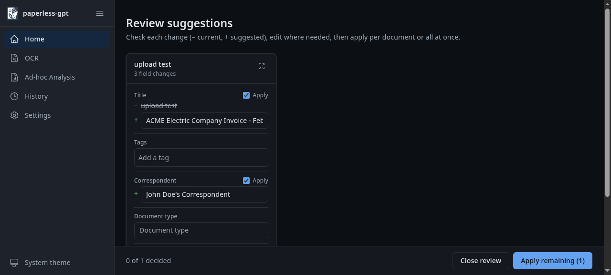

### [Paperless-GPT](https://github.com/icereed/paperless-gpt)

> Handle: `paperless-gpt`<br/>
> URL: [http://localhost:35051](http://localhost:35051)

Paperless-GPT is an LLM companion for [Paperless-ngx](./2.3.94-Satellite-Paperless.md). It picks up documents tagged `paperless-gpt`, asks an LLM for a title, tags, correspondent, document type and created date, lets you review the suggestions, and writes them back. It can also run LLM-based OCR with a vision model.



**Key Features:**
- **Metadata suggestions**: title, tags, correspondent, document type and created date from the document text
- **Review or auto mode**: approve suggestions in the UI (`paperless-gpt` tag) or apply them hands-off (`paperless-gpt-auto` tag)
- **LLM OCR**: optional vision-model OCR for scans that Tesseract handles poorly
- **Editable prompts**: every prompt template is a file under `prompts/` and editable in the UI
- **Local backends**: Ollama or any OpenAI-compatible endpoint, plus hosted providers

#### Starting

```bash
harbor pull paperless-gpt
# With a local LLM backend
harbor up paperless paperless-gpt ollama --open
# or
harbor up paperless paperless-gpt llamacpp --open
```

When started together with `paperless`, `paperless-gpt` waits for it to become healthy (it can also point at an external Paperless-ngx via `PAPERLESS_BASE_URL` in the override env). On startup, Harbor's entrypoint exchanges the Paperless admin credentials for an API token via `/api/token/` and creates the `paperless-gpt` and `paperless-gpt-auto` tags in Paperless-ngx if they are missing, so a fresh stack needs no manual setup.

Security note: the Paperless-GPT UI on port `35051` has no login of its own but holds a full-access admin token for Paperless-ngx. Anyone who can reach that port can read and modify every document. Keep it on localhost or expose it only through Traefik, where Harbor gates the route with HTTP basic auth (see Backend integration), and change the default `admin` / `admin` Paperless credentials (`harbor config set paperless.admin_password <new>`; the new password is applied to the existing user on the next start of `paperless`, and `paperless-gpt` picks it up on restart).

Workflow:

1. Upload a document in Paperless-ngx and add the `paperless-gpt` tag to it (or upload with the tag already set, see below).
2. Open Paperless-GPT, the document appears under "waiting for review". Click **Generate suggestions**.
3. Review the suggested title/tags/correspondent/date and click **Apply** - the document is updated in Paperless-ngx.

Add the `paperless-gpt-auto` tag instead for hands-off processing without review.

The same flow from the shell:

```bash
# id of the trigger tag
TAG=$(curl -s -u admin:admin 'http://localhost:35050/api/tags/?name__iexact=paperless-gpt' | jq '.results[0].id')
# upload a document already tagged for review
curl -u admin:admin -F 'document=@invoice.pdf' -F "tags=$TAG" http://localhost:35050/api/documents/post_document/
# once consumed, it is listed by paperless-gpt
curl -s http://localhost:35051/api/documents | jq '.[] | {id, title}'
```

#### Configuration

##### Environment Variables

Following options can be set via [`harbor config`](./3.-Harbor-CLI-Reference.md#harbor-config):

```bash
# Host port for the web UI
HARBOR_PAPERLESS_GPT_HOST_PORT       35051

# Image and tag
HARBOR_PAPERLESS_GPT_IMAGE           icereed/paperless-gpt
HARBOR_PAPERLESS_GPT_VERSION         latest

# Root for prompts/, config/ and db/
HARBOR_PAPERLESS_GPT_WORKSPACE       ./services/paperless-gpt/data

# Explicit Paperless API token; leave empty to auto-fetch with HARBOR_PAPERLESS_ADMIN_*
HARBOR_PAPERLESS_GPT_API_TOKEN

# Standalone LLM settings (used when no backend cross-file applies)
# Provider: openai | ollama | googleai | mistral | anthropic
HARBOR_PAPERLESS_GPT_LLM_PROVIDER    openai
HARBOR_PAPERLESS_GPT_LLM_MODEL
# Any OpenAI-compatible endpoint
HARBOR_PAPERLESS_GPT_OPENAI_URL
HARBOR_PAPERLESS_GPT_OPENAI_KEY      sk-paperless-gpt
HARBOR_PAPERLESS_GPT_OLLAMA_URL

# Models used by the backend cross-files
HARBOR_PAPERLESS_GPT_OLLAMA_MODEL    qwen2.5:1.5b
HARBOR_PAPERLESS_GPT_LLAMACPP_MODEL  LiquidAI/LFM2.5-8B-A1B-GGUF:Q8_0

# Document language hint included in prompts
HARBOR_PAPERLESS_GPT_LANGUAGE        English

# Tags created in Paperless-ngx on startup (space separated); set empty to skip
HARBOR_PAPERLESS_GPT_BOOTSTRAP_TAGS  paperless-gpt paperless-gpt-auto

# htpasswd line(s) for the basic auth in front of https://paperless-gpt.<HARBOR_TRAEFIK_DOMAIN>
# (comma separated, every "$" of the hash doubled). Default is admin / admin
HARBOR_PAPERLESS_GPT_TRAEFIK_USERS   admin:$$apr1$$...
```

Other upstream variables (`VISION_LLM_PROVIDER`, `VISION_LLM_MODEL`, `OCR_PROCESS_MODE`, `AUTO_TAG`, ...) can be set in `services/paperless-gpt/override.env`.

##### Backend integration

- `ollama`: sets `LLM_PROVIDER=ollama`, `OLLAMA_HOST` to Harbor's Ollama, `LLM_MODEL` to `HARBOR_PAPERLESS_GPT_OLLAMA_MODEL`, and `OLLAMA_THINK=false` so thinking models return the structured suggestion. Pull the model first: `harbor ollama pull qwen2.5:1.5b`.
- `llamacpp`: sets `LLM_PROVIDER=openai` with `OPENAI_BASE_URL=http://llamacpp:8080/v1` and `LLM_MODEL` to `HARBOR_PAPERLESS_GPT_LLAMACPP_MODEL` (must match a model served by the llama.cpp router; a `400 model 'x' not found` in the logs means it does not - `curl http://localhost:33831/models` lists the served names). The first suggestion after a start takes longer while the router loads the model (about half a minute for the default model).
- `paperless`: adds `depends_on: paperless (service_healthy)`, so `paperless-gpt` only starts once the Paperless API is up. The container itself reports `healthy` once its UI on port 8080 answers.
- `traefik`: `harbor up paperless paperless-gpt traefik` serves the UI at `https://paperless-gpt.<HARBOR_TRAEFIK_DOMAIN>` (`https://paperless-gpt.lan` by default). Because the UI has no login of its own, `services/compose.x.paperless-gpt.traefik.yml` attaches a Traefik `basicauth` middleware to that route, fed by `HARBOR_PAPERLESS_GPT_TRAEFIK_USERS` (default `admin` / `admin`; the direct port `35051` stays unauthenticated). The same file sets `PAPERLESS_PUBLIC_URL=https://paperless.<HARBOR_TRAEFIK_DOMAIN>` so the "open in Paperless" links land on the Traefik hostname of Paperless-ngx. Change the credentials before exposing the route - every `$` of the hash has to be doubled because compose interpolates the value:

  ```bash
  harbor config set paperless_gpt.traefik_users "$(htpasswd -nbB user password | sed 's/\$/\$\$/g')"
  harbor up paperless paperless-gpt traefik
  ```

To enable LLM OCR, set `VISION_LLM_PROVIDER=ollama` and `VISION_LLM_MODEL=<vision model>` in the override env.

##### Volumes

| Host path | Container path | Purpose |
|---|---|---|
| `services/paperless-gpt/data/prompts` | `/app/prompts` | Editable prompt templates (also editable under Settings) |
| `services/paperless-gpt/data/config` | `/app/config` | UI settings |
| `services/paperless-gpt/data/db` | `/app/db` | Processing history |

paperless-gpt runs as your host user (`PUID`/`PGID`). The `paperless-gpt-init` sidecar chowns the workspace to your host user (`HARBOR_USER_ID`/`HARBOR_GROUP_ID`) before each start, so files stay manageable without `sudo`.

#### Troubleshooting

##### Check Logs

```bash
harbor logs paperless-gpt
```

- `paperless rejected the credentials for 'admin'` (container exits within seconds): the password in `HARBOR_PAPERLESS_ADMIN_PASSWORD` doesn't match Paperless-ngx, e.g. it was changed in the Paperless UI. Either set the current password with `harbor config set paperless.admin_password <pw>` and restart `paperless paperless-gpt` (the setting is re-applied to the user on start), or set `HARBOR_PAPERLESS_GPT_API_TOKEN` to a token generated in Paperless-ngx (My Profile > API Auth Token).
- `could not obtain a paperless API token`: Paperless-ngx was not reachable within two minutes; check `docker logs harbor.paperless`.
- Suggested tags and correspondents are limited to values that already exist in Paperless-ngx; the model never invents new ones. On a fresh stack the only candidates are the bootstrap tags plus `paperless-gpt-failed`, so create your tags and correspondents in Paperless-ngx first, otherwise suggestions come back empty or with the `paperless-gpt-failed` tag.
- No documents listed: the document needs the `paperless-gpt` tag in Paperless-ngx (created on startup; `[harbor] created paperless tag` in the logs). Documents still in "Processing" in Paperless-ngx are not visible yet.
- Empty suggestions with Ollama: the model is missing (`harbor ollama pull <model>`) or too small; `OLLAMA_THINK=false` is already set by the cross-file.
- `OCR provider is set to LLM, but no VISION_LLM_PROVIDER is set. Disabling OCR.` is expected until a vision model is configured.

#### Links

- [GitHub Repository](https://github.com/icereed/paperless-gpt)
- [Paperless-ngx in Harbor](./2.3.94-Satellite-Paperless.md)
