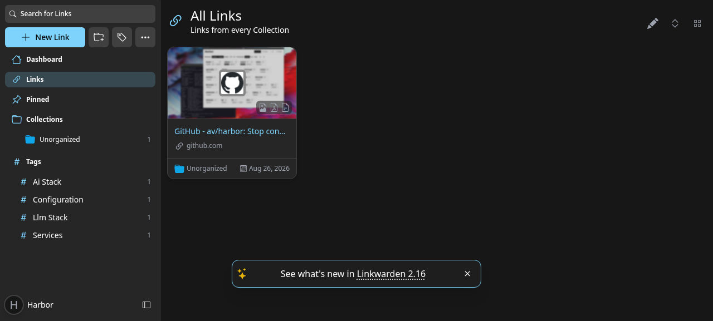

### [Linkwarden](https://github.com/linkwarden/linkwarden)

> Handle: `linkwarden`<br/>
> URL: [http://localhost:35070](http://localhost:35070)



Linkwarden is a self-hosted, collaborative bookmark manager. Every saved link is archived locally so it stays readable even after the original page disappears, and a local LLM from Harbor can tag links for you automatically.

**Key Features:**
- **Full archiving**: screenshot, single-file HTML, PDF and readable view for every link
- **Organisation**: collections, sub-collections, tags and pinned links
- **Full-text search**: powered by a bundled Meilisearch instance
- **AI tagging**: automatic tags from any Harbor LLM backend (Ollama, llama.cpp, vLLM, MLX)
- **Collaboration**: share collections with other users, public collections
- **Browser extension and mobile apps**: save from anywhere via the official clients

#### Starting

```bash
# Pull the images
harbor pull linkwarden

# Start Linkwarden
harbor up linkwarden --open

# With Ollama for AI tagging (nothing pulls the model automatically)
harbor ollama pull qwen2.5:1.5b
harbor up linkwarden ollama
```

- On the first start, create an account via **Sign Up** (registration is enabled by default). Set `NEXT_PUBLIC_DISABLE_REGISTRATION=true` in `services/linkwarden/override.env` afterwards if the instance is reachable by others.
- Linkwarden starts with two auxiliary containers: `linkwarden-db` (PostgreSQL) and `linkwarden-meili` (Meilisearch). The main container waits for both to report healthy before running its database migrations, so a cold first start is safe. Its own healthcheck probes the login page, which answers on an empty database, so `harbor up linkwarden --open` and other services waiting on it are not blocked until someone signs up (a cold first boot reaches `healthy` within seconds of the migrations finishing).
- Archiving happens in a background worker; the screenshot/PDF/readable views appear a few seconds after saving a link.
- To get AI tags, open **Settings → Preference → AI Settings**, choose **Auto-generate Tags** and press the **Save Changes** button directly under that section (each section on the page has its own). A **Settings Applied** toast confirms the preference was stored; without it nothing will ever be tagged (see [Archived but never tagged](#archived-but-never-tagged)).

#### Configuration

##### Environment Variables

Following options can be set via [`harbor config`](./3.-Harbor-CLI-Reference.md#harbor-config) or in `services/linkwarden/override.env`:

```bash
# Web UI port
HARBOR_LINKWARDEN_HOST_PORT           35070

# Public origin the login flow redirects back to (NEXTAUTH_URL without /api/v1/auth).
# Empty: http://localhost:<port>, or https://linkwarden.<HARBOR_TRAEFIK_DOMAIN> when traefik is in the stack
HARBOR_LINKWARDEN_PUBLIC_URL          ""

# Linkwarden image
HARBOR_LINKWARDEN_IMAGE               ghcr.io/linkwarden/linkwarden
HARBOR_LINKWARDEN_VERSION             latest

# Root directory for persistent data (data/, pgdata/, meili/)
HARBOR_LINKWARDEN_WORKSPACE           ./services/linkwarden

# NextAuth session secret - change for anything beyond local use
HARBOR_LINKWARDEN_NEXTAUTH_SECRET     harbor-linkwarden-secret

# PostgreSQL sidecar
HARBOR_LINKWARDEN_DB_IMAGE            postgres
HARBOR_LINKWARDEN_DB_VERSION          16-alpine
HARBOR_LINKWARDEN_DB_PASSWORD         linkwarden

# Meilisearch sidecar
HARBOR_LINKWARDEN_MEILI_IMAGE         getmeili/meilisearch
HARBOR_LINKWARDEN_MEILI_VERSION       v1.13.3
HARBOR_LINKWARDEN_MEILI_MASTER_KEY    harbor-linkwarden-meili

# Model used for AI tagging with Ollama (harbor up linkwarden ollama)
HARBOR_LINKWARDEN_OLLAMA_MODEL        qwen2.5:1.5b
# Model used for AI tagging with llama.cpp (harbor up linkwarden llamacpp)
HARBOR_LINKWARDEN_LLAMACPP_MODEL      LiquidAI/LFM2.5-8B-A1B-GGUF:Q8_0

# Let the archive worker fetch hosts on the private Docker network (see the security note below)
HARBOR_LINKWARDEN_ALLOW_PRIVATE_NETWORK_ACCESS  true

# Archive worker: links picked up per batch, and how many minutes the headless
# browser may spend on a single link before it is aborted
HARBOR_LINKWARDEN_ARCHIVE_TAKE_COUNT  5
HARBOR_LINKWARDEN_BROWSER_TIMEOUT     5
```

Any other [Linkwarden environment variable](https://docs.linkwarden.app/self-hosting/environment-variables) can be added to `services/linkwarden/override.env` or set with `harbor env linkwarden <KEY> <VALUE>`.

`ALLOW_PRIVATE_NETWORK_ACCESS=true` is set by default so Linkwarden can archive pages served by other Harbor services on the internal Docker network (for example a Windmill app or an Open WebUI share link).

**Security note:** this also means any logged-in Linkwarden user can make the archive worker fetch *any* host the container can reach, including other Harbor services and their unauthenticated endpoints (an `http://linkwarden-meili:7700/health` link archives fine). Treat it as a server-side request path: if Linkwarden is exposed to users you do not fully trust (for example through traefik), set `harbor config set linkwarden.allow_private_network_access false` and keep sensitive services off the shared network.

Pinning `HARBOR_LINKWARDEN_VERSION` to an older tag can break archiving: older images set `PLAYWRIGHT_BROWSERS_PATH`/`HOME` differently and the bundled browser is then not found under the host user Harbor runs the container as. Stay on `latest` or a recent tag and check `docker logs harbor.linkwarden` for `browserType.launch` errors after changing it.

##### AI Tagging

When started together with a Harbor LLM backend, Linkwarden is pre-configured to use it for automatic tagging:

```bash
harbor up linkwarden ollama     # uses HARBOR_LINKWARDEN_OLLAMA_MODEL
harbor up linkwarden llamacpp   # uses HARBOR_LINKWARDEN_LLAMACPP_MODEL
harbor up linkwarden vllm       # uses HARBOR_VLLM_MODEL
harbor up linkwarden mlx        # uses HARBOR_MLX_MODEL
```

Pull the Ollama model first: `harbor ollama pull qwen2.5:1.5b` (`HARBOR_LINKWARDEN_OLLAMA_MODEL`); nothing pulls it automatically, and a missing model produces no tags and no error in the UI.

Tagging is off per user until enabled: open **Settings → Preference → AI Settings**, pick an AI tagging method (*Auto-generate Tags*, *Based on existing Tags* or *Based on predefined Tags*) and save that section. Tags are generated after a link has been archived, so they appear shortly after saving (about 30 seconds with `qwen2.5:1.5b`; the worker polls every 10 seconds). The worker logs `Auto-tagging link ...` when it picks a link up. Ticking *Generate tags for existing Links* before saving also queues links saved before tagging was enabled.

`services/linkwarden/check-runtime.sh tags` runs the whole workflow unattended against a running stack (registers a `harbor-check` user, enables *Auto-generate Tags*, saves a link, waits for tags, deletes the link) and is what Harbor's fact checks use; `check-runtime.sh link` does the same without the AI step.

Backends other than Ollama are wired through Linkwarden's custom OpenAI-compatible provider (`CUSTOM_OPENAI_BASE_URL`), so only one of them can be active at a time; when it is set together with `ollama`, the OpenAI-compatible backend takes precedence.

To change the model on the fly:

```bash
harbor config set linkwarden.ollama_model qwen3.5:4b
harbor up linkwarden ollama
```

##### Volumes

Linkwarden persists data in the following directories:
- `services/linkwarden/data/` - archived files (screenshots, PDFs, HTML, readable views)
- `services/linkwarden/pgdata/` - PostgreSQL database (owned by the container's postgres user, so `sudo` is needed to inspect or delete it)
- `services/linkwarden/meili/` - Meilisearch index

##### File ownership

Linkwarden and its Meilisearch sidecar run as your host user (via `HARBOR_USER_ID`/`HARBOR_GROUP_ID`). A small `linkwarden-init` sidecar chowns `data/` and `meili/` before each start, since Docker creates missing bind-mount targets as `root`. Everything in the workspace except `pgdata/` (owned by the `postgres` user inside the container) can therefore be managed without `sudo`.

#### Integration with Harbor

- Any Harbor LLM backend can be used for tagging via the cross-files listed above; the connection is internal to the Harbor network and never leaves your machine.
- **Settings → RSS Subscriptions** polls feeds into a collection of your choice; new entries are archived (and tagged, when enabled) like any saved link, and feeds on the Harbor network work thanks to `ALLOW_PRIVATE_NETWORK_ACCESS`.
- Linkwarden exposes a REST API at `http://localhost:35070/api/v1` with API keys created under **Settings → Access Tokens**, which is handy for Windmill flows or other Harbor automation.
- The official [browser extension](https://docs.linkwarden.app/getting-started#browser-extension) can be pointed at `http://localhost:35070`.
- With [traefik](./2.3.37-Satellite-traefik.md) in the stack (`harbor up linkwarden traefik`) Linkwarden is served at `https://linkwarden.<HARBOR_TRAEFIK_DOMAIN>` (default `https://linkwarden.lan`) and the cross-file points `NEXTAUTH_URL` at that hostname, so logging in there lands on `https://linkwarden.lan/dashboard` instead of bouncing to `localhost`. Linkwarden switches to secure cookies whenever its public URL is `https`, so in that mode use the traefik hostname rather than `http://localhost:35070`. Set `harbor config set linkwarden.public_url <origin>` to pin any other public origin (for example a reverse proxy of your own, or `http://localhost:35070` to keep the direct port canonical while traefik runs).

#### Troubleshooting

##### Check Logs

```bash
# All containers
harbor logs linkwarden

# Specific container
harbor logs linkwarden-db
harbor logs linkwarden-meili
```

##### No tags appear

- Verify the AI tagging method is enabled in your user preferences and that the LLM backend container is running (`harbor ps`).
- Tagging runs after archiving inside the same worker queue, so on a bulk import tags show up minutes after the links and lag behind the archive backlog. Give it time before assuming it failed.
- Verify the backend answers from inside the Harbor network:
  - Ollama: `harbor ollama ls` must list the model, otherwise `harbor ollama pull qwen2.5:1.5b`; `harbor exec linkwarden curl -s http://ollama:11434/api/tags` should return it.
  - llama.cpp: `harbor exec linkwarden curl -s http://llamacpp:8080/v1/models` must list `HARBOR_LINKWARDEN_LLAMACPP_MODEL`.
  - vLLM / MLX: `harbor exec linkwarden curl -s http://vllm:8000/v1/models` (or `http://mlx:8080/v1/models`) must list `HARBOR_VLLM_MODEL` / `HARBOR_MLX_MODEL`.
- Tags are only generated for links that have extracted text or a description, so pages that fail to archive are never tagged.
- Small models sometimes return malformed output; try a larger model via `HARBOR_LINKWARDEN_OLLAMA_MODEL`.

##### Archived but never tagged

A link with its screenshot/PDF/readable view in place but no tags after a couple of minutes almost always means the tagging preference was never stored: the AI Settings section has its own **Save Changes** button and the change is only sent when that one is pressed (a **Settings Applied** toast confirms it). Check what the server holds:

```bash
harbor exec linkwarden-db psql -U postgres -c 'select username, "aiTaggingMethod" from "User"'
```

`DISABLED` means the worker skips the user entirely (no `Auto-tagging link` lines, no requests to the backend): set the method again and save. Links archived while it was `DISABLED` are not revisited unless *Generate tags for existing Links* is ticked when saving. With the method stored, `docker logs harbor.linkwarden` shows `Auto-tagging link <url>` followed by `Succeeded auto-tagging link` (or the backend error) within about 20 seconds of the link's archive finishing; `services/linkwarden/check-runtime.sh tags` exercises the full path end to end and prints the tags it got.

##### Archiving stuck or failing

- The bundled headless browser needs a few seconds per link; look for `Error` lines in `harbor logs linkwarden`.
- Sites that block headless browsers still get a readable view when their HTML is fetchable; screenshots and PDFs will be missing.
- Non-HTML URLs (plain-text files, very large pages) can hold the browser for the full `HARBOR_LINKWARDEN_BROWSER_TIMEOUT` (5 minutes) and then log `Browser has been open for more than 5 minutes`; the link is marked unavailable and the worker moves on. Lower the timeout if you import many such links.
- `Monolith output exceeded buffer limit` means the single-file HTML archive for that page was too big and was skipped; the screenshot, PDF and readable view are still produced.
- Small models sometimes log `Unexpected token ... in JSON` from the tagging step; the link is archived, only its tags are missing (see above).

##### Linkwarden container exited after archiving

The image runs the web app and the archive worker in one container under `concurrently -k`, so a crash in either process stops the other and the whole container exits. This has been observed after a bulk import: a link that hit the 5-minute browser timeout aborted with an unhandled `write EPIPE`, the worker exited 1, the web app was terminated, and the remaining links were left unarchived with the UI unreachable.

Harbor sets `restart: unless-stopped` on the Linkwarden containers so Docker brings the container straight back and the worker resumes the backlog on its own; `harbor ps` shows a fresh uptime and `docker logs harbor.linkwarden` shows the crash followed by a new startup. If you have removed the restart policy, `docker start harbor.linkwarden` does the same by hand. Remaining links are picked up within a minute or two of the restart, so nothing needs to be re-added.

##### Database issues

If migrations fail or the database is corrupted:

```bash
harbor down linkwarden
# WARNING: destroys all data
sudo rm -rf services/linkwarden/pgdata services/linkwarden/meili
harbor up linkwarden
```

#### Links

- [Official Documentation](https://docs.linkwarden.app/)
- [GitHub Repository](https://github.com/linkwarden/linkwarden)
- [Environment Variables Reference](https://docs.linkwarden.app/self-hosting/environment-variables)
